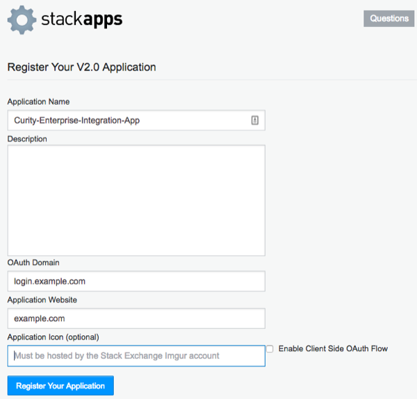

StackExchange Authenticator Plugin
==================================

.. image:: https://travis-ci.org/curityio/stackexchange-authenticator.svg?branch=master
    :target: https://travis-ci.org/curityio/stackexchange-authenticator

This project provides an opens source StackExchange Authenticator plug-in for the Curity Identity Server. This allows an administrator to add functionality to Curity which will then enable end users to login using their StackOverflow, SuperUser, ServerFault or other StackExchange credentials. The app that integrates with Curity may also be configured to receive the StackExchange access token, allowing it to manage StackExchange resources.

System Requirements
~~~~~~~~~~~~~~~~~~~

* Curity Identity Server 2.4.0 and `its system requirements <https://developer.curity.io/docs/latest/system-admin-guide/system-requirements.html>`_

Requirements for Building from Source
"""""""""""""""""""""""""""""""""""""

* Maven 3
* Java JDK v. 8

Compiling the Plug-in from Source
~~~~~~~~~~~~~~~~~~~~~~~~~~~~~~~~~

The source is very easy to compile. To do so from a shell, issue this command: ``mvn package``.

Installation
~~~~~~~~~~~~

To install this plug-in, either download a binary version available from the `releases section of this project's GitHub repository <https://github.com/curityio/stackexchange-authenticator/releases>`_ or compile it from source (as described above). If you compiled the plug-in from source, the package will be placed in the ``target`` subdirectory. The resulting JAR file or the one downloaded from GitHub needs to placed in the directory ``${IDSVR_HOME}/usr/share/plugins/stackexchange``. (The name of the last directory, ``stackexchange``, which is the plug-in group, is arbitrary and can be anything.) After doing so, the plug-in will become available as soon as the node is restarted.

.. note::

    The JAR file needs to be deployed to each run-time node and the admin node. For simple test deployments where the admin node is a run-time node, the JAR file only needs to be copied to one location.

For a more detailed explanation of installing plug-ins, refer to the `Curity developer guide <https://developer.curity.io/docs/latest/developer-guide/plugins/index.html#plugin-installation>`_.

Creating an App in StackExchange
~~~~~~~~~~~~~~~~~~~~~~~~~~~~~~~~

To create a new app in StackExchange, go to the `app registration page <https://stackapps.com/apps/oauth/register>`_. Enter a ``Name`` and ``Application Website``. For the ``OAuth Domain``, use as specific of a domain as you can (e.g., ``login.example.com`` rather than ``example.com``). Leave the ``Enable Client Side OAuth Flow`` option unticked. Finally, click the ``Register`` button. An example app is shown in the following figure:

Take note of the client ID, secret and app key. These will be needed when configuring Curity.

Once the app is registered, it will be provisioned and can be viewed from the `list of Stack Apps <https://stackapps.com/apps/oauth/>`_. At this point, the configuration in StackExchange is done and an instance of the authenticator can be configured in Curity.

Creating a StackExchange Authenticator in Curity
~~~~~~~~~~~~~~~~~~~~~~~~~~~~~~~~~~~~~~~~~~~~~~~~

The easiest way to configure a new StackExchange authenticator is using the Curity admin UI. The configuration for this can be downloaded as XML or CLI commands later, so only the steps to do this in the GUI will be described.

1. Go to the ``Authenticators`` page of the authentication profile wherein the authenticator instance should be created.
2. Click the ``New Authenticator`` button.
3. Enter a name (e.g., ``stackexchange1``).
4. For the type, pick the ``StackExchange`` option:

    .. figure:: docs/images/stackexchange-authenticator-type-in-curity.png
        :align: center
        :width: 600px

5. On the next page, you can define all of the standard authenticator configuration options like any previous authenticator that should run, the resulting ACR, transformers that should executed, etc. At the bottom of the configuration page, the StackExchange-specific options can be found.

        .. note::

            The StackExchange-specific configuration is generated dynamically based on the `configuration model defined in the Java interface <https://github.com/curityio/stackexchange-authenticator/blob/master/src/main/java/io/curity/identityserver/plugin/stackexchange/descriptor/StackExchangeAuthenticatorPluginDescriptor.java>`_.

6. Certain required and optional configuration settings may be provided. One of these is the ``HTTP Client`` setting. This is the HTTP client that will be used to communicate with the StackExchange OAuth server's token and user info endpoints. This will only be required if the calls to StackExchange are made through a forwarding proxy or there is an benign SSL Man-in-the-Middle that uses some untrusted SSL certificate. To define this, do the following:

    A. click the ``Facilities`` button at the top-right of the screen.
    B. Next to ``HTTP``, click ``New``.
    C. Enter some name (e.g., ``stackexchangeClient``).
    D. Toggle on the ``Use Truststore`` or ``Proxy`` options as needed. When finished, click ``Apply``.

7. Back in the StackExchange authenticator instance that you started to define, select the new HTTP client from the dropdown if you created one; otherwise, leave this setting blank.
8. In the ``Client ID`` textfield, enter the client ID from the StackExchange app configuration. This is the auto-generated ID that was shown after register it. Also enter the matching ``Client Secret`` and ``App Key``.
9. If wish to request certain scopes from StackExchange during user login, toggle on the desired scopes (e.g., ``Write Access``).

Once all of these changes are made, they will be staged, but not committed (i.e., not running). To make them active, click the ``Commit`` menu option in the ``Changes`` menu. Optionally enter a comment in the ``Deploy Changes`` dialogue and click ``OK``.

Once the configuration is committed and running, the authenticator can be used like any other.

License
~~~~~~~

This plugin and its associated documentation is listed under the `Apache 2 license <LICENSE>`_.

More Information
~~~~~~~~~~~~~~~~

Please visit `curity.io <https://curity.io/>`_ for more information about the Curity Identity Server.

Copyright (C) 2017 Curity AB.